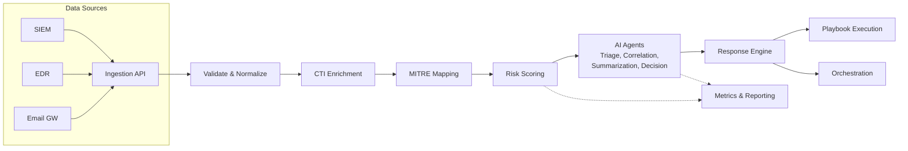

# AI-Native Cyber Resilience Architecture

[](https://github.com/iamprbkr/ai-native-cyber-resilience-architecture/actions/workflows/ci.yml)
[](https://github.com/iamprbkr/ai-native-cyber-resilience-architecture/actions/workflows/security-scan.yml)
[](https://www.python.org/)
[](LICENSE)
[](CONTRIBUTING.md)
[](https://github.com/NeevNaav)
[](https://docs.astral.sh/ruff/)
[](https://github.com/PyCQA/bandit)

---

**A comprehensive, production-grade reference blueprint for building an AI-native cyber resilience platform and autonomous SOC.** This repository provides architecture documentation, GRC artifacts, incident response playbooks, secure Python code, and infrastructure configurations — all aligned to NIST CSF 2.0, ISO 27001:2022, MITRE ATT&CK, and Zero Trust principles (NIST SP 800-207).

---

## Aim & Motivation

| Dimension | Description |
|-----------|-------------|
| **Aim** | Provide a reusable, standards-aligned blueprint for modernizing security operations with AI/ML capabilities |
| **Motivation** | SOCs face alert fatigue, slow triage, siloed tools, inconsistent response, and hard-to-measure resilience. AI-native architecture addresses all five problems. |
| **Goal** | Reduce MTTR by 90%, false positives by 60%, and analyst workload by 70% through intelligent automation |
| **ROI** | 668% over 3 years, payback in under 5 months ([full analysis](grc/roi-analysis.md)) |
| **Usability** | Reference docs for architects, runnable code for engineers, playbooks for analysts |
| **Feasibility** | Python-based, vendor-neutral, deployable via Docker Compose or Kubernetes |
| **Testability** | 30+ unit/integration/security tests with CI pipeline |

## Who This Is For

- **Security Architects** — Reference architecture for next-gen SOC design, RFPs, and workshops
- **CISOs / vCISOs** — Framework alignment (NIST CSF, ISO 27001), ROI analysis, GRC artifacts
- **DevSecOps Engineers** — Runnable code, Docker deployment, CI/CD templates
- **SOC Analysts** — Playbooks, triage workflows, automated response patterns
- **Students & Researchers** — Applied AI in cybersecurity, threat modeling, secure coding

## Architecture Overview



**Key Pipeline Stages:**
1. **Ingestion** — Validate, sanitize, and normalize alerts from any source
2. **Enrichment** — Threat intelligence context, MITRE ATT&CK mapping
3. **Risk Scoring** — Composite score (0–100) from severity, asset criticality, threat context
4. **AI Agents** — ML/LLM-powered triage, correlation, summarization, and decision support
5. **Response** — Playbook-driven automated containment, eradication, recovery
6. **Reporting** — Resilience metrics, compliance dashboards, KPI tracking

## Repository Structure

```
.
├── README.md, LICENSE, SECURITY.md, CONTRIBUTING.md, CODE_OF_CONDUCT.md
├── .github/             # CI/CD, issue templates, PR template, Dependabot
├── src/                 # Core Python package
│   ├── ingestion/       # Alert validation and normalization
│   ├── enrichment/      # CTI enrichment and MITRE mapping
│   ├── scoring/         # Composite risk scoring engine
│   ├── correlation/     # Alert-to-incident correlation
│   ├── response/        # Playbook execution and connectors
│   ├── ai/              # ML/LLM agents (triage, correlation, summarization, decision)
│   ├── reporting/       # Metrics, resilience score, report generation
│   └── security/        # RBAC, audit logging, sanitization, secrets management
├── architecture/        # C4 diagrams, threat model, Zero Trust, NIST/ISO mappings
├── grc/                 # Risk register, control matrix, policies, ROI analysis, KPIs
├── playbooks/           # 8 incident response playbooks (YAML)
├── config/              # Scoring policy, MITRE mappings, data classification, logging
├── tests/               # 30+ tests (unit, integration, security)
├── docker/              # Dockerfiles, Docker Compose, env template
└── docs/                # Getting started, deployment guide, glossary
```

## Quick Start

```bash
# Install
pip install -e ".[dev,test]"

# Run the pipeline with sample data
python -c "
from src.ingestion.service import IngestionService
from src.enrichment.service import EnrichmentService
from src.scoring.engine import RiskScoringEngine
from src.response.engine import ResponseEngine

svc = IngestionService()
alerts = svc.load_from_json('examples/sample-alerts.json')
enrich = EnrichmentService()
score = RiskScoringEngine()
resp = ResponseEngine()

for a in alerts:
    e = enrich.enrich(a)
    s = score.score(e)
    r = resp.handle_alert(s)
    print(f'{s.id}: risk={s.risk_score}, priority={s.priority}, {r[\"status\"]}')
"
```

## Test & Lint

```bash
make test        # Run all tests with coverage
make lint        # Ruff linting
make typecheck   # MyPy type checking
make security    # Bandit SAST scan
```

## GRC & Compliance

| Framework | Artifact |
|-----------|----------|
| NIST CSF 2.0 | [Full mapping](architecture/nist-csf-mapping.md) |
| ISO 27001:2022 | [Control mapping](architecture/iso-27001-mapping.md) |
| MITRE ATT&CK | [Technique mapping](config/mitre-attack-mapping.yaml) |
| MITRE D3FEND | [Defensive mapping](config/mitre-d3fend-mapping.yaml) |
| Zero Trust (SP 800-207) | [Architecture](architecture/zero-trust-architecture.md) |
| STRIDE | [Threat model](architecture/threat-model.md) |
| Risk Register | [Document](grc/risk-register.yaml) |
| ROI Analysis | [Model](grc/roi-analysis.md) |

## Key Deliverables

| Deliverable | Description |
|-------------|-------------|
| Reference architecture | C4 diagrams, data flow, component descriptions |
| Secure Python package | Pydantic models, input sanitization, RBAC, audit logging, secrets management |
| AI/ML agents | Triage, correlation, summarization, decision support with LLM prompts |
| 8 IR playbooks | Generic, ransomware, phishing, DDoS, insider threat, supply chain, data breach, exfiltration |
| GRC artifacts | Risk register, control matrix, policy framework, compliance mappings, BCP/DR, ROI model |
| CI/CD pipeline | GitHub Actions, linting, testing, SAST, dependency scanning |
| Docker deployment | Multi-service Docker Compose, production hardening guide |
| 30+ tests | Unit, integration, security — with fixtures and coverage reporting |

## Skills Demonstrated

- **Full-stack security architecture** — Python, Pydantic, YAML, Docker, CI/CD
- **AI/ML integration** — ML classification, LLM prompt engineering, agent-based architecture
- **GRC & compliance** — NIST CSF, ISO 27001, MITRE ATT&CK/D3FEND, Zero Trust
- **Secure coding** — Input sanitization, RBAC, audit logging, secrets management, SAST
- **Threat modeling** — STRIDE per component, attack trees, data flow threats
- **DevOps** — Docker, CI/CD, Make, pre-commit, dependency management
- **Documentation** — C4 diagrams, architecture decisions, ADRs, glossaries
- **Risk management** — Risk registers, control matrices, ROI analysis, BCP/DR

## Roadmap

- [x] Core architecture and codebase
- [x] GRC artifacts and compliance mappings
- [x] AI agents with ML/LLM integration
- [x] CI/CD pipeline with security scanning
- [x] Docker infrastructure
- [x] 30+ test suite with coverage
- [ ] C4 diagrams as interactive HTML
- [ ] Real SIEM integration examples (Elastic, Splunk, Wazuh)
- [ ] Kubernetes Helm charts
- [ ] LLM agent with actual API integration
- [ ] Dashboard mockup (HTML/CSS)
- [ ] Threat intelligence feed integration (MISP, OpenCTI)
- [ ] MITRE Caldera simulation integration
- [ ] SBOM generation in CI

## Governance

This project is stewarded by **NeevNaav**. See [GOVERNANCE.md](GOVERNANCE.md) for roles, decision-making, and the contribution process. All contributors must sign the [DCO](DCO.md) (`git commit -s`).

## License

MIT — see [LICENSE](LICENSE). Free to use, modify, and distribute.

## Author

**iamprbkr** — Global Cybersecurity & Resilience Leader, vCISO/DPO, Full-Stack Security Architect, PhD researcher  
**Steward:** [NeevNaav](https://github.com/NeevNaav)

[GitHub](https://github.com/iamprbkr) | [LinkedIn](https://linkedin.com/in/iamprbkr)
