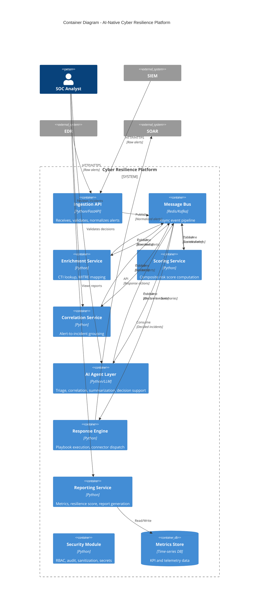

# C4 Container Diagram — Level 2

```mermaid
C4Container
  title Container Diagram - AI-Native Cyber Resilience Platform

  Person(analyst, "SOC Analyst")

  System_Boundary(platform, "Cyber Resilience Platform") {
    Container(ingestion_api, "Ingestion API", "Python/FastAPI", "Receives, validates, normalizes alerts")
    Container(message_bus, "Message Bus", "Redis/Kafka", "Async event pipeline")
    Container(enrichment, "Enrichment Service", "Python", "CTI lookup, MITRE mapping")
    Container(scoring, "Scoring Service", "Python", "Composite risk score computation")
    Container(correlation, "Correlation Service", "Python", "Alert-to-incident grouping")
    Container(ai_agents, "AI Agent Layer", "Python/LLM", "Triage, correlation, summarization, decision support")
    Container(response_engine, "Response Engine", "Python", "Playbook execution, connector dispatch")
    Container(reporting, "Reporting Service", "Python", "Metrics, resilience score, report generation")
    Container(security, "Security Module", "Python", "RBAC, audit, sanitization, secrets")
    ContainerDb(metrics_db, "Metrics Store", "Time-series DB", "KPI and telemetry data")
  }

  System_Ext(siem, "SIEM")
  System_Ext(edr, "EDR")
  System_Ext(soar, "SOAR")

  Rel(siem, ingestion_api, "HTTP/HTTPS", "Raw alerts")
  Rel(edr, ingestion_api, "HTTP/HTTPS", "Raw alerts")
  Rel(ingestion_api, message_bus, "Publish", "Normalized alerts")

  Rel(message_bus, enrichment, "Consume", "Raw alerts")
  Rel(enrichment, message_bus, "Publish", "Enriched alerts")
  Rel(message_bus, scoring, "Consume", "Enriched alerts")
  Rel(scoring, message_bus, "Publish", "Scored alerts")
  Rel(message_bus, correlation, "Consume", "Scored alerts")
  Rel(correlation, message_bus, "Publish", "Incidents")
  Rel(message_bus, ai_agents, "Consume", "Alerts + Incidents")
  Rel(ai_agents, message_bus, "Publish", "Decisions + Summaries")
  Rel(message_bus, response_engine, "Consume", "Decided incidents")
  Rel(response_engine, soar, "API", "Response actions")

  Rel(analyst, reporting, "Views reports")
  Rel(analyst, correlation, "Reviews incidents")
  Rel(analyst, ai_agents, "Validates decisions")

  Rel(reporting, metrics_db, "Read/Write")
```
