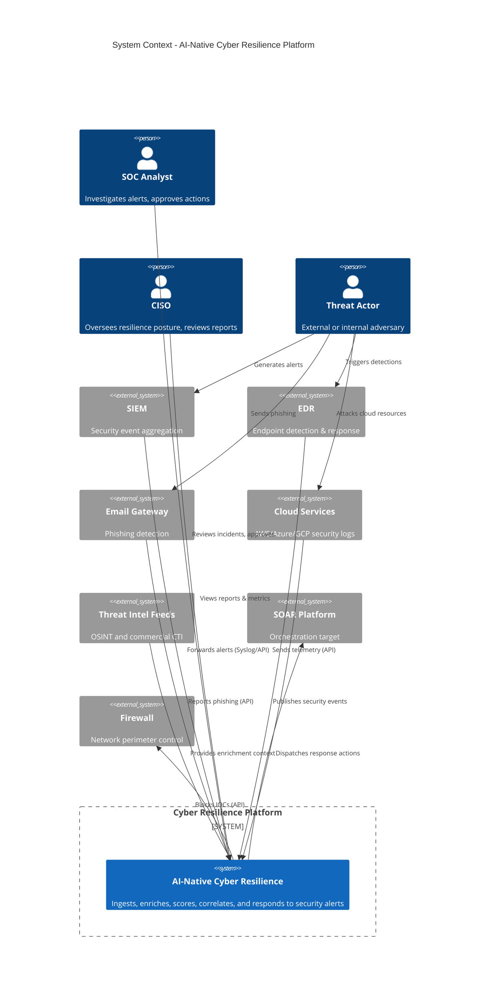

# C4 Context Diagram — Level 1

```mermaid
C4Context
  title System Context - AI-Native Cyber Resilience Platform

  Person(analyst, "SOC Analyst", "Investigates alerts, approves actions")
  Person(ciso, "CISO", "Oversees resilience posture, reviews reports")
  Person(attacker, "Threat Actor", "External or internal adversary")

  System_Boundary(resilience, "Cyber Resilience Platform") {
    System(platform, "AI-Native Cyber Resilience", "Ingests, enriches, scores, correlates, and responds to security alerts")
  }

  System_Ext(siem, "SIEM", "Security event aggregation")
  System_Ext(edr, "EDR", "Endpoint detection & response")
  System_Ext(email_gw, "Email Gateway", "Phishing detection")
  System_Ext(cloud, "Cloud Services", "AWS/Azure/GCP security logs")
  System_Ext(cti, "Threat Intel Feeds", "OSINT and commercial CTI")
  System_Ext(soar, "SOAR Platform", "Orchestration target")
  System_Ext(fw, "Firewall", "Network perimeter control")

  Rel(attacker, siem, "Generates alerts")
  Rel(attacker, edr, "Triggers detections")
  Rel(attacker, email_gw, "Sends phishing")
  Rel(attacker, cloud, "Attacks cloud resources")

  Rel(siem, platform, "Forwards alerts (Syslog/API)")
  Rel(edr, platform, "Sends telemetry (API)")
  Rel(email_gw, platform, "Reports phishing (API)")
  Rel(cloud, platform, "Publishes security events")

  Rel(cti, platform, "Provides enrichment context")
  Rel(platform, soar, "Dispatches response actions")
  Rel(platform, fw, "Blocks IOCs (API)")

  Rel(analyst, platform, "Reviews incidents, approves")
  Rel(ciso, platform, "Views reports & metrics")
```
