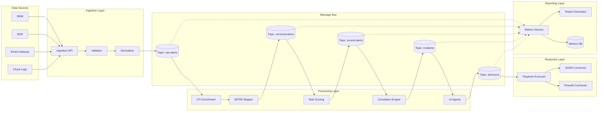

# Data Flow Diagram

## Data Classification by Stage

| Stage | Classification | Retention | Encryption |
|-------|---------------|-----------|------------|
| Raw alert (source) | Internal | 90 days | TLS in transit |
| Normalized alert | Internal | 90 days | At rest encrypted |
| Enriched alert | Confidential | 90 days | At rest encrypted |
| Scored alert | Confidential | 90 days | At rest encrypted |
| Incident | Confidential | 1 year | At rest encrypted |
| Decision/Action | Confidential | 2 years | At rest encrypted |
| Metrics/Reports | Internal | 2 years | At rest encrypted |
